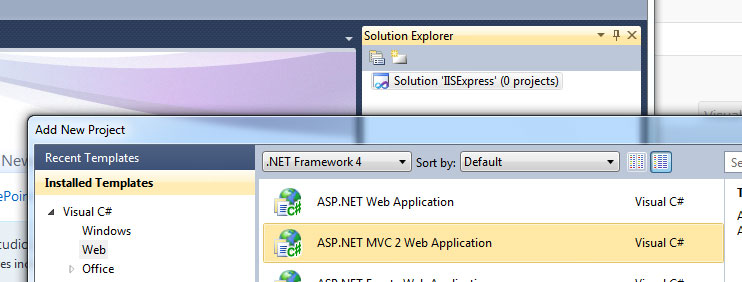
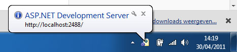
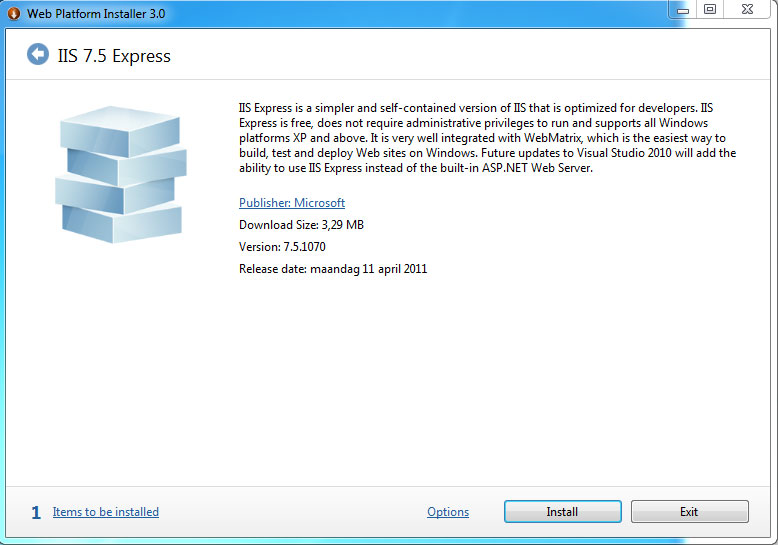
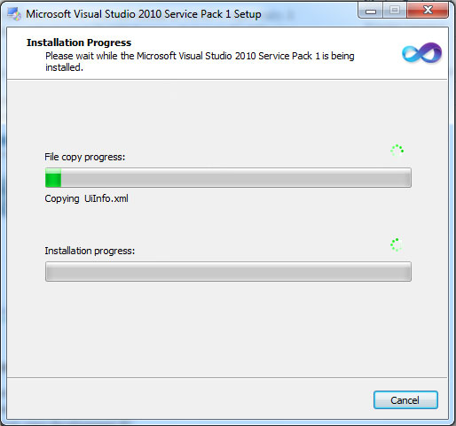
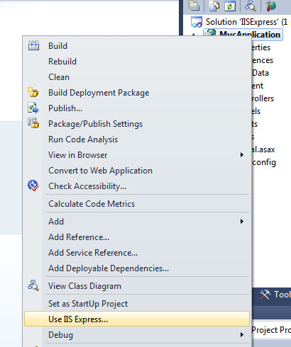
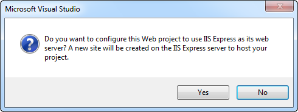
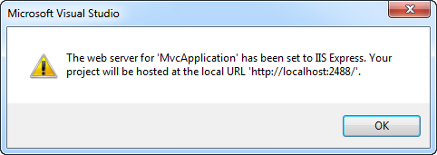

# IIS Express

## Introduction

Tired of developing ASP.NET web sites with the ASP.NET Development Server (Cassini) or the IIS version that was installed along with your Windows operating system?

Cassini works great in most cases, but sometimes you want to test some functionality (SSL,...) that it cannot handle and you have to go through the hassle of hosting your site in IIS.

Let's quickly setup IIS Express...

## The Old Way

Let's start up Visual Studio 2010 and create a new blank solution called "IISExpress". Next add a new ASP.NET MVC 2 web application to the solution called MvcApplication.

Make sure to use the ASP.NET 2 Web Application project template so that you'll wind up with a dummy site which contains a couple of pages and has some styling. Skip the creation of the test project. Once the project has been added just start it up by hitting F5.

By default the ASP.NET Development Server will be started to host the site. You can see it popping up in the system tray.

It does not support the full set of features offered by IIS, so let's replace it with IIS Express.

## Installation

IIS 7.5 Express is part of [WebMatrix](http://www.microsoft.com/web/webmatrix/features.aspx) or you can choose to [install it separately](http://www.microsoft.com/web/gallery/install.aspx?appid=IISExpress). I opted for the later option and only installed IIS Express. Just go to the following page:

[http://www.microsoft.com/web/gallery/install.aspx?appid=IISExpress](http://www.microsoft.com/web/gallery/install.aspx?appid=IISExpress)

and click on the big green "Install Now" button. The Web Platform Installer (Web PI) will take care of the rest.

## Running IIS 7.5 Express

IIS 7.5 Express does not require any administrative privileges to run and/or debug applications so it's ideal if the company you are working for does not grant you administrative privileges on your development PC.

Let's launch the demo web application we created earlier via IIS Express. Oops...wait...before you can do this make sure that you have installed service pack 1 for Visual Studio 2010. If this is not the case, you can download the service pack here:

[http://www.microsoft.com/downloads/en/details.aspx?FamilyID=75568aa6-8107-475d-948a-ef22627e57a5](http://www.microsoft.com/downloads/en/details.aspx?FamilyID=75568aa6-8107-475d-948a-ef22627e57a5 "http://www.microsoft.com/downloads/en/details.aspx?FamilyID=75568aa6-8107-475d-948a-ef22627e57a5")

Let's quickly install the Visual Studio 2010 Service Pack 1.

After one long installation and a reboot we can finally continue. Start up Visual Studio 2010 and reopen the IISExpress solution. If you right-click on the web application project you'll be presented with a new option called "Use IIS Express".

Upon clicking this option the following dialog will popup:

Click Yes to create a new site within IIS Express.

Now hit F5 again to start the application and you'll notice that Cassini won't be started. Instead the IIS Express icon will appear in your system tray.

Voila, that's all there is to it. Using IIS 7.5 Express and Visual Studio 2010 Service Pack 1 it's very easy to switch from Cassini to IIS Express.
