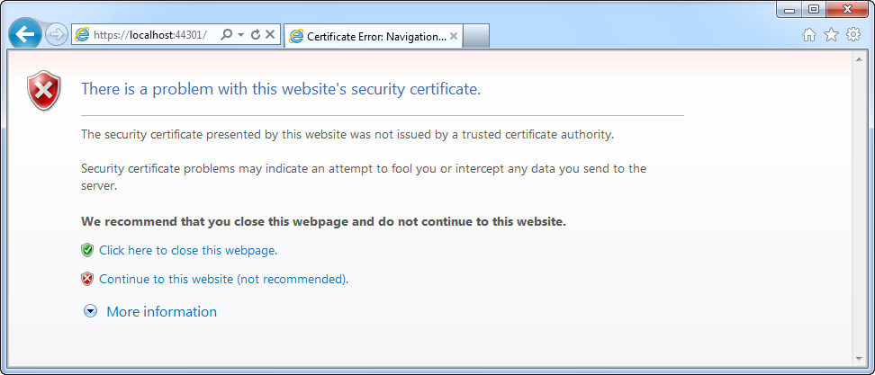

# IIS Express: HTTP and HTTPS

## Introduction

Continuing on the [previous article](../part-1/README.md), this post discusses the creation of a simple web application hosted by IIS Express using a feature which Cassini doesn't support, namely HTTPS.

The built-in Cassini web server (ASP.NET Development Server) only supports HTTP. So if you want to, for instance, use HTTPS when developing a WCF service you are stuck and you'll have to resort to hosting it in IIS.

Using IIS Express life gets simpler...

## Calculator Service

Let's quickly setup a WCF-powered service for demonstration purposes. Start Visual Studio 2010 (SP1), create a new blank solution called "IISExpressHttps" and add a new empty ASP.NET MVC 2 project to it. Let's be original and call the MVC application "MvcApplication".


Delete all of the default content (Content, Controllers, Models, Scripts & Views). Next add an interface (ICalculator.cs), a class (Calculator.cs) and a Service.svc file (just add a class and rename it's extension to ".svc").

Your project's layout should now resemble the following screenshot:


The ICalculator interface only contains one method.

```csharp
interface ICalculator
{
    int Add(int x, int y);
}
The Calculator class implements the ICalculator interface and is equally simple.

public class Calculator : ICalculator
{
    public int Add(int x, int y)
    {
        return x + y;
    }
}
```

The `Service.svc` file specifies which service to host and only contains one line.

```xml
<%@ServiceHost language=c# Service="MvcApplication.Calculator" %>
```

Next add a reference to the System.ServiceModel assembly and add the following section to your application's configuration file (Web.config).

```xml
<system.serviceModel>
  <services>
    <service name="Calculator">
      <endpoint address ="Calculator" binding="wsHttpBinding" contract="ICalculator" />
      <endpoint address="mex" binding="mexHttpBinding" contract="IMetadataExchange"/>
    </service>
  </services>
  <behaviors>
    <serviceBehaviors>
      <behavior>
        <serviceMetadata httpGetEnabled="True"/>
        <serviceDebug includeExceptionDetailInFaults="False" />
      </behavior>
    </serviceBehaviors>
  </behaviors>
</system.serviceModel>
```

Right-click on the MVC application in the solution explorer and select "Use IIS Express...".


Hit F5 to run your application and navigate to the Service.svc file (or set it as the default start page).

Voila, the calculator service is now up and running.


## SSL Enabled

Now for the hard easy part, enabling SSL. Go back to Visual Studio and select the MVC application in the solution explorer. In the properies window you need to set the property "SSL Enabled" to true.


Hit F5 to run your application again. By default the HTTP protocol will be used. Right-click on the IIS Express icon displayed in the system tray and you can see which sites are hosted. If you select the MvcApplication you'll notice that you now have the option to use the HTTPS protocol. Of course a different port will be used.


Now you can visit https://localhost:44301. Just select the URL to open the site. You'll be greeted by the following message:



Just click the option "Continue to this website" and voila...you are now running your service via HTTPS on IIS Express.


## Non-HTTP Protocols

Does IIS Express support non-HTTP protocols such as net.tcp, MSMQ...etc? Nope, unfortunately not at the moment. More information can be found on the [IIS Express FAQ](http://learn.iis.net/page.aspx/901/iis-express-faq/).

I started writing this post trying to setup a WCF service with NetTcpBinding hosted by IIS Express. Only to find out, halfway through, that it only supports HTTP protocols. Alas, maybe in a future version?

## More Information

If you require more information on SSL and IIS Express I suggest you check out the following article:

[http://www.hanselman.com/blog/WorkingWithSSLAtDevelopmentTimeIsEasierWithIISExpress.aspx](http://www.hanselman.com/blog/WorkingWithSSLAtDevelopmentTimeIsEasierWithIISExpress.aspx)

Written by Microsoft's Scott Hanselman, its a more in-depth article and disusses some more advanced options.
